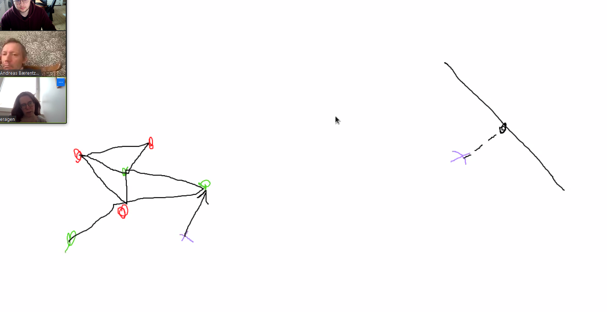

# Points before meetings and the answers during
## Longer time than anticipated
**Q:** Andreas assumed, that it was 12 weeks when doing 20 ects, and then 3 weeks added for each 5 ects point course after, but looking at the study guide from DTU, it says 15 weeks for 20 ects?   
**A:** I calculated it wrong.

## What do they exactly expect, what is the big picture
**Q:** What is the big picture of the projects, the endgoal if you will. What is the wanted product, when the project is finished?  
**A:** Få det til at virke som semisupervised learning. Lav et skelet ud fra de forskellige mnist tal, og brug det til at forudsige.

**Q:** How to find distance.  
**A:** Distance can be calculated in different ways, one is to multiply the two vertices of pixels values with eachother, to get one number representing, the distance between the two. It might be, that this is not a good solution, and that it is easier to do it other ways. Tweaks could be:
* Blurring
* Downsampling

### How to test
**Q:** How to test, when data is multidimensional
**A:** Lav en sekskant i 4 dimensioner. Tilføj en masse støj rundt om kanter og knuder. Lav et skelet ud fra disse, og se på afstanden mellem den originale og den nye graf.

## What is the expected outcome [*mightask*]
**Q:** It might be nice to know how well they expect this to work, and so fourth

## Project Plan
**Q:** What is this exactly, is it a written report, or is it more like a gant diagram?  
**A:** Write motivation. Why is this interesting for different people. Also what is exactly expected as the outcome for this project. What is the final product. *Aasa*: Make a little bulletpoints list. 

**Q:** What is the motivation for the data.  
**A:** *Aasa:* Hopes it gives better results. *Andreas:* Hopes it gives better visualisation.

**Q:** What do you mean by visualisation  
**A:** He hopes to explicitley giving some visualisation of how the data is connected. The output should give a 1 dimensional graph, that can tell something about the data. Seeing the structure of the data might make working with it more intuitive.

## Meetings, how often?
**Q:** Writing alone, and might need some guidence, what should i expect in terms of accesibility to the different teachers?  
**A:** Advisors don't have a lot of time on their hands, and there are multiple opinions on how to proceed with project so it is preffered, to have fewer meetings, that however enables multiple advisors to be present at the same time, heightening the quality of the meetings.

## Example of how to measure, which catagory an image belongs to. 
### (Look at closest vertex to begin with, more sophisticated methods might be introduced later)
